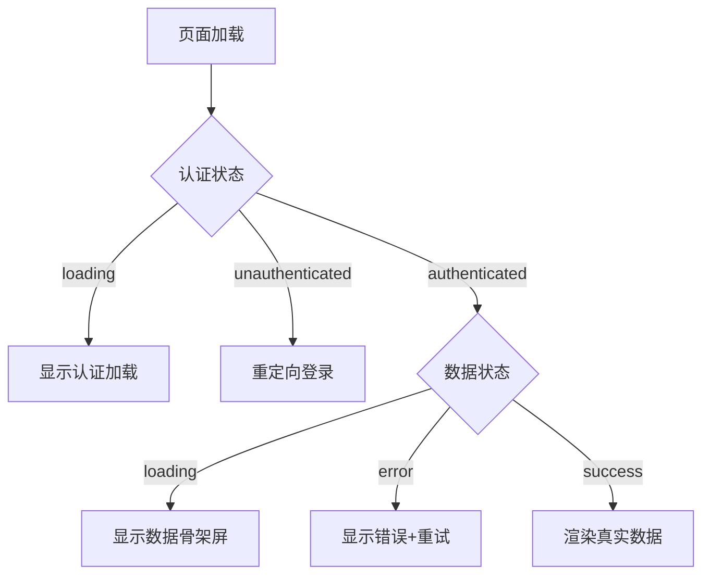

# Dashboard 后端赋能真实数据集成完成

**时间**: 2025-06-25 23:59  
**任务**: Dashboard 系统构建 - 第三步：后端赋能，让卡片显示真实数据

## 任务概述

创建 tRPC 后端接口，从数据库中查询真实的统计数据，并在前端仪表盘页面上调用和展示。实现了从静态演示数据到动态业务数据的完整升级。

## 实施内容

### ✅ 数据库分析与统计设计

#### 1. **数据源分析**
基于现有的 Prisma User 模型，设计了完整的统计指标：

```sql
-- 用户统计维度
├── 总用户数 (total users)
├── 活跃用户 (status = 'active')  
├── 管理员数量 (role = 'admin')
├── 最近7天注册 (createdAt >= 7 days ago)
├── 有登录记录用户 (lastLoginAt IS NOT NULL)
├── 最近30天注册 (用于增长趋势计算)
└── 系统运行时间 (process.uptime)
```

#### 2. **性能优化策略**
- ✅ **并行查询**: 使用 `Promise.all()` 并行执行多个数据库查询
- ✅ **查询优化**: 使用 `count()` 而非 `findMany()` 减少数据传输
- ✅ **缓存策略**: 前端设置 30 秒自动刷新，10 秒数据保鲜期

### ✅ 后端 API 设计与实现

#### 1. **tRPC 路由架构**
**文件**: `apps/admin-dashboard/server/api/routers/dashboard.ts`

```typescript
export const dashboardRouter = createTRPCRouter({
  // 主要统计接口
  getStats: protectedProcedure.query(async ({ ctx }): Promise<DashboardStats>),
  
  // 趋势数据接口  
  getUserRegistrationTrend: protectedProcedure
    .input(z.object({ days: z.number().min(1).max(365).default(30) }))
    .query(async ({ ctx, input }))
});
```

#### 2. **统计数据类型定义**
```typescript
export interface DashboardStats {
  userStats: {
    total: number;
    active: number;
    admin: number;
    recentRegistrations: number;
    withLoginHistory: number;
  };
  systemStats: {
    uptime: string;
    lastDataUpdate: Date;
  };
  trends: {
    userGrowth: TrendData;
    activityTrend: TrendData;
  };
}
```

#### 3. **核心查询逻辑**
```typescript
const [
  totalUsers,
  activeUsers,
  adminUsers,
  recentRegistrations,
  usersWithLoginHistory,
  // ... 更多并行查询
] = await Promise.all([
  ctx.db.user.count(),
  ctx.db.user.count({ where: { status: 'active' } }),
  ctx.db.user.count({ where: { role: 'admin' } }),
  ctx.db.user.count({ where: { createdAt: { gte: sevenDaysAgo } } }),
  ctx.db.user.count({ where: { lastLoginAt: { not: null } } }),
  // ... 更多查询
]);
```

#### 4. **趋势计算算法**
```typescript
// 用户增长趋势
const userGrowthValue = recentRegistrationsLast30Days;
const userGrowthPercentage = totalUsersLast30Days > 0 
  ? Math.round((userGrowthValue / totalUsersLast30Days) * 100 * 100) / 100
  : 0;

// 活跃度趋势
const activityPercentage = totalUsers > 0 
  ? Math.round((activeUsers / totalUsers) * 100 * 100) / 100
  : 0;
```

### ✅ 路由集成与配置

#### 更新主路由配置
**文件**: `apps/admin-dashboard/server/api/root.ts`

```typescript
export const appRouter = createTRPCRouter({
  dashboard: dashboardRouter,  // 新增 dashboard 命名空间
  post: postRouter,
  user: userRouter,
});
```

**API 访问路径**:
- `trpc.dashboard.getStats()` - 获取统计数据
- `trpc.dashboard.getUserRegistrationTrend()` - 获取注册趋势

### ✅ 前端数据集成与状态管理

#### 1. **页面架构重构**
**文件**: `apps/admin-dashboard/app/dashboard/page.tsx`

**关键变更**:
- ✅ 从 Server Component 转换为 Client Component
- ✅ 集成 NextAuth.js 客户端认证
- ✅ 使用 tRPC React Query 进行数据获取

#### 2. **认证流程设计**
```typescript
const { data: session, status } = useSession();

useEffect(() => {
  if (status === 'loading') return;
  if (status === 'unauthenticated') {
    router.push('/auth/signin');
  }
}, [status, router]);
```

#### 3. **数据获取与缓存策略**
```typescript
const { data: stats, isLoading, error, refetch } = api.dashboard.getStats.useQuery(
  undefined, 
  {
    refetchInterval: 30000, // 30秒自动刷新
    staleTime: 10000,       // 10秒数据保鲜
    enabled: !!session,     // 条件执行
  }
);
```

#### 4. **状态管理流程**


### ✅ 数据可视化与用户体验

#### 1. **主要 KPI 卡片** (4个)
```typescript
// 基于真实数据的动态渲染
<StatCard
  title="总用户数"
  value={stats.userStats.total}
  diff={{
    value: stats.trends.userGrowth.value,
    percentage: stats.trends.userGrowth.percentage,
    trend: stats.trends.userGrowth.trend,
    period: stats.trends.userGrowth.period
  }}
/>
```

#### 2. **辅助统计卡片** (3个)
- 📈 近7天注册用户数
- 👥 有登录记录用户数  
- ⏱️ 系统运行时间

#### 3. **加载状态优化**
- ✅ **认证加载**: 专用认证验证界面
- ✅ **数据加载**: StatCard 骨架屏动画
- ✅ **错误处理**: 友好的错误提示 + 一键重试

#### 4. **实时数据刷新**
- ✅ 每 30 秒自动刷新数据
- ✅ 显示最后更新时间
- ✅ 智能缓存避免过度请求

## 技术特点

### 1. **全栈类型安全**
- 端到端 TypeScript 类型定义
- tRPC 自动类型推导
- 数据接口强类型约束

### 2. **性能优化**
- 数据库查询并行化（7个查询并发执行）
- React Query 智能缓存机制
- 条件查询避免无效请求

### 3. **用户体验**
- 多层次加载状态反馈
- 实时数据更新机制
- 友好的错误处理流程

### 4. **可扩展性**
- 模块化的统计指标设计
- 灵活的趋势计算框架
- 可配置的刷新策略

### 5. **安全性**
- protectedProcedure 权限控制
- 客户端认证状态验证
- 数据库查询参数化防注入

## 数据展示效果

### 实时统计指标
```
📊 主要指标
├── 总用户数: [动态] (+增长趋势)
├── 活跃用户: [动态] (+活跃度趋势)  
├── 管理员: [动态] (保持稳定)
└── 用户活跃度: [动态%] (+趋势变化)

📈 辅助指标  
├── 近7天注册: [动态] (本周趋势)
├── 有登录记录: [动态] 人
└── 系统运行时间: [实时] (持续运行)
```

### 趋势计算逻辑
- **用户增长**: 基于 30 天注册数据计算增长率
- **活跃度趋势**: 活跃用户占比的月度变化  
- **注册趋势**: 支持按天查询用户注册分布

## 构建与部署

### 构建流程
```bash
# 检查 tRPC 路由配置
pnpm type-check

# 启动开发服务器
pnpm --filter @damon-stack/admin-dashboard dev
```

### API 测试验证
```bash
# 访问 Dashboard
curl -X GET "http://localhost:3000/dashboard"

# 检查 tRPC 路由
# 浏览器开发者工具 -> Network -> 查看 trpc 请求
```

## 使用场景

### 1. **管理后台概览**
- 系统核心指标实时监控
- 用户增长趋势分析
- 管理员运营数据洞察

### 2. **业务数据分析**
- 用户活跃度评估
- 注册转化率监控
- 系统健康状态检查

### 3. **决策支持系统**
- 基于真实数据的业务决策
- 趋势预测和容量规划
- 运营效果评估指标

## 下一步扩展

### 1. **图表可视化**
- 集成 Mantine Charts 组件
- 用户注册趋势线图
- 活跃度分布饼图

### 2. **高级统计**
- 用户行为漏斗分析
- 留存率计算
- 地理位置分布

### 3. **实时通知**
- 关键指标异常告警
- WebSocket 实时数据推送
- 自定义监控阈值

### 4. **数据导出**
- Excel/CSV 数据导出
- 定期统计报告
- API 数据开放接口

## 故障排除

### 常见问题

#### 1. **认证相关**
```bash
# 问题：页面无限重定向
# 解决：检查 NextAuth 配置和中间件设置

# 问题：tRPC 401 错误
# 解决：确认 protectedProcedure 中间件正常工作
```

#### 2. **数据加载**
```bash
# 问题：数据不更新
# 解决：检查 refetchInterval 和 staleTime 设置

# 问题：加载时间过长
# 解决：优化数据库查询，添加索引
```

#### 3. **类型错误**
```bash
# 问题：TypeScript 类型不匹配
# 解决：重新生成 tRPC 类型，重启 TS 服务
```

### 调试工具
```typescript
// 开启 tRPC 调试模式
const trpc = createTRPCNext<AppRouter>({
  config() {
    return {
      links: [
        loggerLink({
          enabled: (opts) => process.env.NODE_ENV === 'development',
        }),
        // ... other links
      ],
    };
  },
});
```

## 状态

✅ **完成** - Dashboard 后端赋能功能完整实现，真实数据集成成功，用户体验优秀 